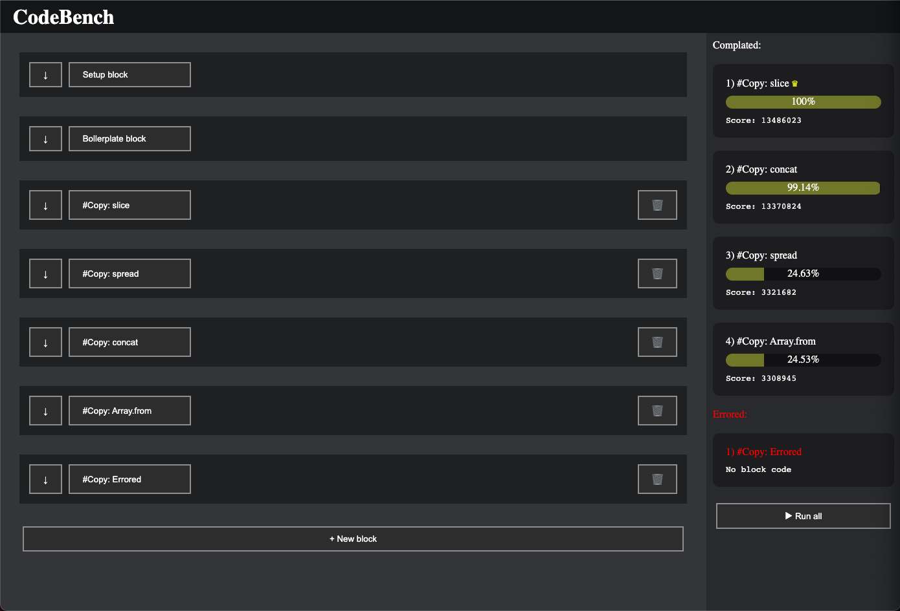
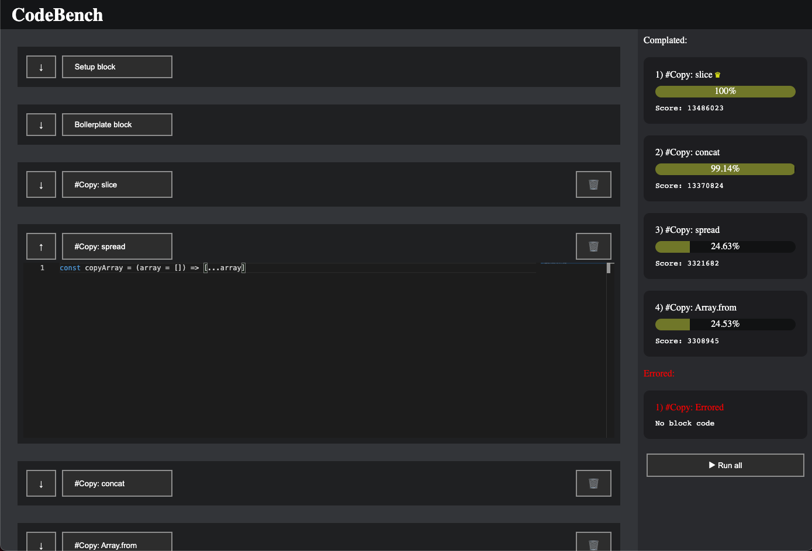

# CodeBench

Easy editor and test speed JS code

## For run

```bash
> npm install
> npm run dev
```

## For build

```bash
> npm install
> npm run build
```

## Screens

> [](screens/screen1.png)
>
> [](screens/screen2.png)
